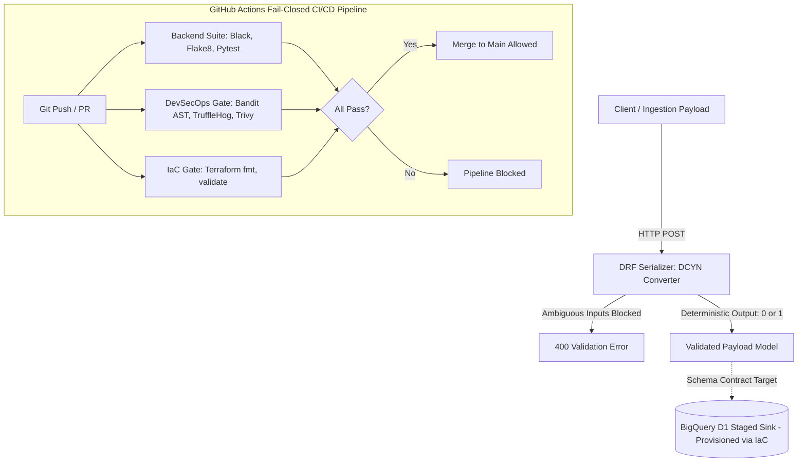

# Poka-Yoke DevSecOps CI/CD Gatekeeper

[](https://github.com/Mcakohli/poka-yoke-devsecops-gatekeeper/actions/workflows/poka_yoke_gatekeeper.yml)
[](https://opensource.org/licenses/MIT)
[](https://www.python.org/downloads/release/python-3110/)
[](https://www.terraform.io/)

"fail-closed CI/CD gatekeeper that blocks merges when validation or security gates fail."

---

## Architecture & Engineering Principles


1. **Poka-Yoke Ingestion (Mistake-Proofing)**:
   * Employs Django REST Framework (DRF) serializers with custom deterministic converters (`DCYN` logic).
   * Transforms ambiguous/freeform survey inputs into strict binary integer flags (`1` or `0`) before payloads hit downstream data lakes.
2. **Shift-Left DevSecOps Gatekeepers**:
   * **Bandit**: Static AST analysis to block Python security flaws.
   * **TruffleHog**: High-entropy verified credential and secret leak detection.
   * **Trivy**: Comprehensive filesystem vulnerability and misconfiguration scanning.
3. **Infrastructure-as-Code Compliance**:
   * Automated modular Terraform linting (`fmt`) and semantic validation (`validate`) for BigQuery dataset provisioning and IAM role bindings.

---

## CI/CD Pipeline Matrix

| Gatekeeper Job | Tools Used | Enforcement Objective |
| :--- | :--- | :--- |
| **Backend Quality & Tests** | `black`, `flake8`, `pytest` | Code standard formatting, syntax linting, and Automated unit tests covering positive, negative, and ambiguous DCYN inputs. |
| **DevSecOps Security** | `bandit`, `trufflehog`, `trivy` | Zero AST security vulnerabilities, zero committed secrets, and CVE scanning. |
| **Terraform IaC** | `terraform fmt`, `terraform validate` | Strict HCL canonical formatting and valid resource dependency graphs. |

---

## Local Development & Testing

```bash
# 1. Install dependencies
pip install -r backend/requirements.txt

# 2. Run Python formatting & linting
black --check backend/
flake8 backend/ --max-line-length=88

# 3. Run Unit Test Suite
pytest backend/tests/ -v

# 4. Validate Terraform
cd infrastructure/terraform
terraform init -backend=false
terraform validate
